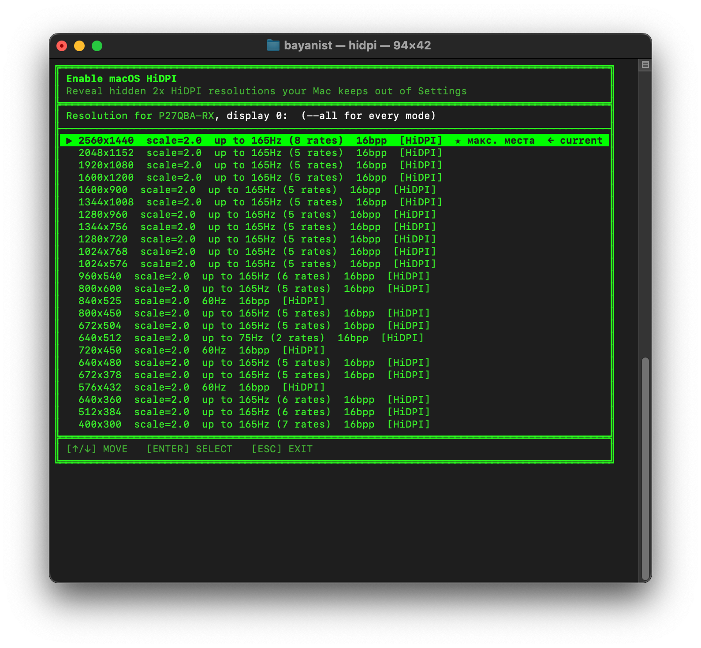

# HIDPI

CLI для включения настоящего **HiDPI (Retina 2x)** на физическом мониторе — **без виртуального дисплея** и **без правки `/Library/Displays`**. Раскрывает масштабированные режимы, которые macOS генерирует сама, но прячет из «Настроек», через приватный CoreGraphics/SkyLight API.

<p align="center">
  
  
  
  
</p>

<p align="center">
  
</p>

### Особенность: системный виджет «Larger Text ↔ More Space»
Плитки-пресеты в «Настройках → Мониторы» рисует **сама macOS и только для панелей, которые считает Retina (4K/5K)**. На **1440p (QHD)** их не завести без EDID-override, а на **Apple Silicon** override для внешних мониторов ненадёжен (EDID не отдаётся системой). Поэтому `hidpi` включает HiDPI **напрямую** и даёт выбор разрешения в терминальном пикере — список HiDPI-режимов, отсортированный от максимального рабочего места к меньшему.

## Установка одной командой

```sh
curl -fsSL https://raw.githubusercontent.com/titovcode/hidpi/main/install.sh | bash
```

Скрипт скачает исходники, соберёт релиз, положит бинарник в `/usr/local/bin/hidpi` (спросит пароль на `sudo`) и сразу запустит. Требуется macOS и Xcode Command Line Tools (`xcode-select --install`).

### Сборка из исходников

```sh
git clone https://github.com/titovcode/hidpi.git
cd hidpi
swift build -c release   # бинарник: .build/release/hidpi
```

## Команды

| Команда | Что делает |
|---|---|
| `hidpi` · `hidpi pick` | Интерактивный пикер HiDPI-разрешений |
| `hidpi pick --all` | Показать вообще все режимы (включая 1x и мелкие) |
| `hidpi list` | Онлайн-дисплеи: модель, индекс, текущий режим |
| `hidpi modes -d 0 --hidpi` | Только HiDPI-режимы дисплея 0 |
| `hidpi set -d 0 -w 2560 -h 1440 -s 2` | Применить 2560×1440 HiDPI (макс. места) |
| `hidpi set -d 0 -w 2560 -h 1440 -s 1` | Нативный режим без HiDPI |
| `hidpi set -d 0 --mode 168` | Применить режим по индексу из `modes` |
| `hidpi install` | Скопировать бинарник в `/usr/local/bin` |

В пикере: `↑/↓` — навигация, `Enter` — применить, `Esc` — выход. Крупнейший HiDPI помечен `★ макс. места`, текущий — `← current`.

## Опции

| Опция | Назначение | По умолчанию |
|---|---|---|
| `-d, --display N` | Индекс дисплея | `0` |
| `-w, --width W` | Ширина в пикселях | текущая |
| `-h, --height H` | Высота в пикселях | текущая |
| `-s, --scale S` | Множитель (`2.0` = HiDPI) | `2.0` |
| `-b, --bits B` | Глубина цвета (`16` \| `32`) | текущая |
| `--mode IDX` | Режим по индексу из `modes` | — |
| `--hidpi` | (для `modes`) только HiDPI-режимы | — |
| `-a, --all` | (для `pick`) все режимы, включая 1x | — |

## Какой режим выбирать

`scale=2.0` означает, что рабочее пространство W×H рендерится в 2W×2H пикселей.

| Панель | Рекомендация | Итог |
|---|---|---|
| **4K** (3840×2160) | `1920×1080 HiDPI` | чёткий «ретина» 2x → рендер 3840×2160 |
| **1440p** (2560×1440) | `1280×720 HiDPI` (идеальный 2x) | крупный UI, максимально чётко |
| **1440p** (2560×1440) | `1920×1080 HiDPI` | рендер 3840×2160 → даунскейл (суперсэмплинг, мягче, грузит GPU) |

## Проверенное оборудование

| Компонент | Модель / Спецификация | Статус |
|---|---|---|
| **Mac** | Mac mini (M4), Apple Silicon | ✅ OK |
| **macOS** | 15.7 Sequoia | ✅ OK |
| **Монитор** | P27QBA-RX · 2560×1440 (VID `0x61A9` / PID `0xD005`) | ✅ HiDPI работает |
| **Текущий режим** | 2560×1440 @ 165 Гц · scale 2.0 · 16bpp | ✅ HiDPI |
| **Тулчейн** | Swift 6.1 / swift-tools 5.9 | ✅ OK |

## Границы метода

Рантайм-API только **раскрывает** HiDPI-режимы, которые macOS уже сгенерировала. Если панель «недостаточно плотная» (1440p и ниже), macOS не создаёт часть HiDPI-режимов, а их набор в `hidpi modes --hidpi` — это всё, что доступно. Создать новый HiDPI-режим из ничего рантайм не может: для этого нужен EDID-override в `/Library/Displays` (на Apple Silicon работает ненадёжно).

### Notes
- Приватный недокументированный API. Не совместим с App Store, может ломаться между версиями macOS.
- Layout структуры режима (`modes_D4`) взят из проекта [RDM](https://github.com/usr-sse2/RDM) (MIT) и проверен на macOS 15.7 / Apple Silicon.
- `set` меняет активный дисплей немедленно; выбор сохраняется между перезагрузками (`kCGConfigurePermanently`); `sudo` не требуется.
- Для системного HiDPI-UI и доп. разрешений на Apple Silicon рабочее стороннее решение — [BetterDisplay](https://github.com/waydabber/BetterDisplay) (виртуальный дисплей).

## Лицензия

MIT — см. [LICENSE](LICENSE).
